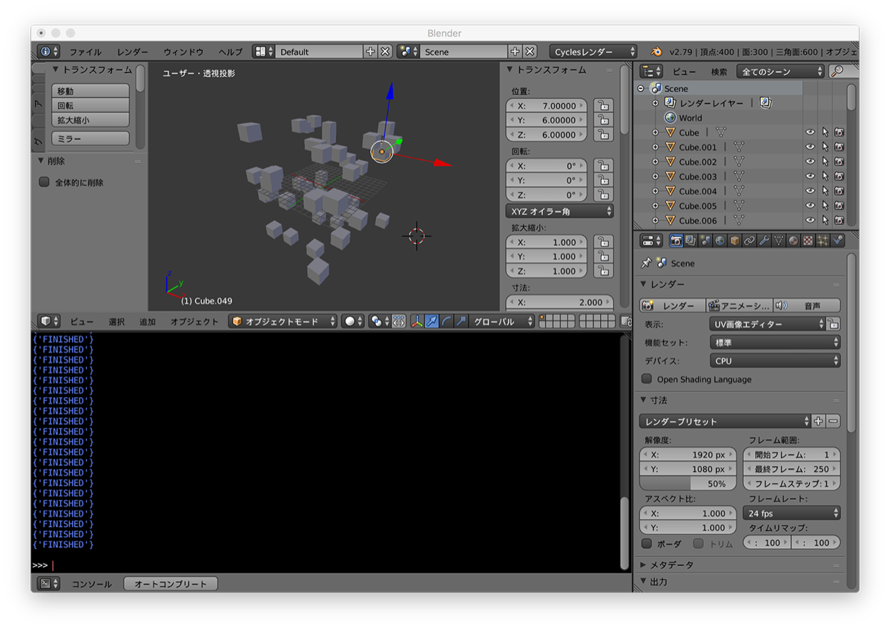
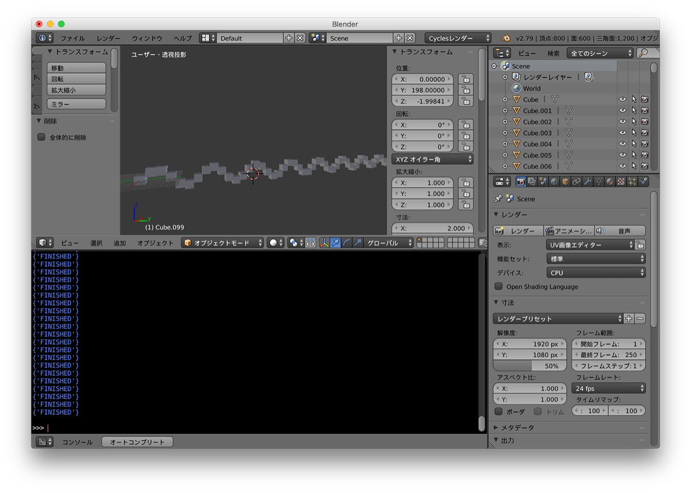
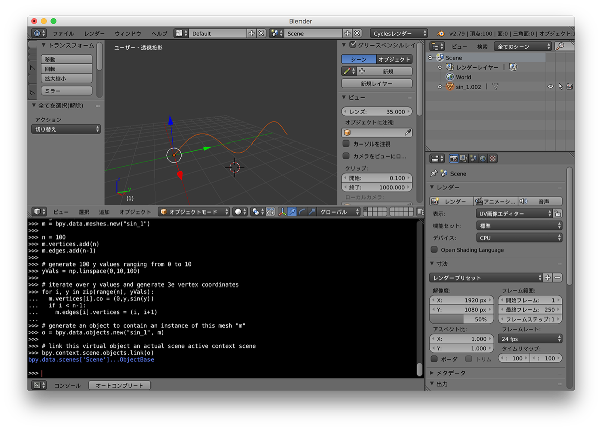
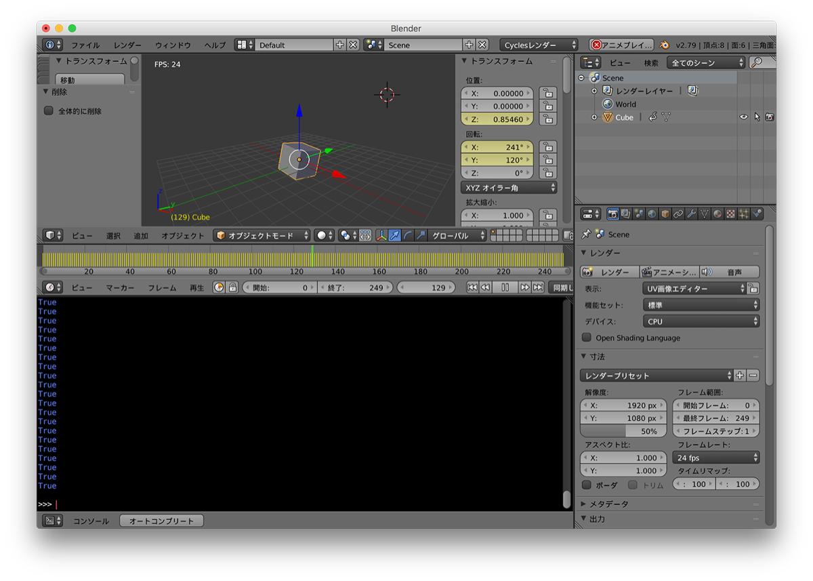

# Creating-Awesome3D-With-Python  


180902  

[https://www.youtube.com/watch?v=GiCcK039x_o](https://www.youtube.com/watch?v=GiCcK039x_o)

source code ↓  
[https://github.com/Tlousky/blender_scripts/tree/master/pycon2016il](https://github.com/Tlousky/blender_scripts/tree/master/pycon2016il)


---  


### what's bpy  

blender python API  
bpy module  

additional module  
- bmesh  
- bge // game engine  
- bgl // opengl  
- blf // font  
- mathutils  


---  

### Sample Scripts  


### random  

```python
import bpy
from random import randint

# generate 50 cubes in random location
for i in range(50):
  bpy.ops.mesh.primitive_cube_add(
    location = [randint(-10,10) for axis in "xyz"]
  )

```
  


---  


### Array with Sine Curve  

```python
import bpy
from math import sin

# generate 100 cubes along a sine curve  
for i in range(100):
  x,y,z = 0,i*2,sin(i)*2
  bpy.ops.mesh.primitive_cube_add(
    location = [x,y,z]
  )

```
  


---  


### Generate a polygonal mesh with numpy  

```python
import bpy
import numpy as np

from math import sin

def linspace(start, end, n):
  step = (end - start)/n
  return [start+ i*step for i in range(n)]

# generate new mesh
m = bpy.data.meshes.new("sin_1")

n = 100
m.vertices.add(n)
m.edges.add(n-1)

# generate 100 y values ranging from 0 to 10
yVals = np.linspace(0,10,100)

# iterate over y values and generate 3e vertex coordinates
for i, y in zip(range(n), yVals):
  m.vertices[i].co = (0,y,sin(y))
  if i < n-1:
    m.edges[i].vertices = (i, i+1)

# generate an object to contain an instance of this mesh "m"
o = bpy.data.objects.new("sin_1", m)

# link this virtual object an actual scene active context scene
bpy.context.scene.objects.link(o)

```

  


---  


### Animation  

[https://github.com/Tlousky/blender_scripts/blob/master/pycon2016il/csv2blender_animated.py](https://github.com/Tlousky/blender_scripts/blob/master/pycon2016il/csv2blender_animated.py)


```python
import bpy  
from math import sin
from math import cos
from math import pi

# Add cube (box) object
bpy.ops.mesh.primitive_cube_add(location=(0,0,0))

x = 361

for i in range(x):
  old_value = i
  old_min = 0
  old_max = x-1
  new_min = 0
  new_max = 2*pi
  new_value = ((old_value - old_min) / (old_max - old_min)) * (new_max - new_min) + new_min
  cube = bpy.data.objects[bpy.context.object.name]
  cube.location.z = cos(new_value*7)*2
  cube.rotation_euler.x = new_value*5
  cube.rotation_euler.y = new_value*3
  cube.scale.y = (2+sin(new_value*4)*1.25)
  bpy.context.scene.update()
  cube.keyframe_insert(data_path = 'location', index = 2, frame = i) # index : 0=x, 1=y, 2=z
  cube.keyframe_insert(data_path = "rotation_euler", index=0, frame=i)
  cube.keyframe_insert(data_path = "rotation_euler", index=1, frame=i)
  cube.keyframe_insert(data_path = "scale", index=1, frame=i)


```

オブジェクトの名前変更  


```python
import bpy  
from math import sin
from math import cos
from math import pi

# Add cube (box) object
bpy.ops.mesh.primitive_cube_add(location=(0,0,0))
bpy.context.object.name = "cube1"
print(bpy.data.objects[bpy.context.object.name])


fc = 361
ex0 = 0

for i in range(ex0, fc+ex0):
  old_value = i
  old_min = 0
  old_max = x-1
  new_min = 0
  new_max = 2*pi
  new_value = ((old_value - old_min) / (old_max - old_min)) * (new_max - new_min) + new_min
  cube = bpy.data.objects[bpy.context.object.name]
  cube.location.x = sin(new_value*8)*3
  cube.location.y = cos(new_value*8)*3
  cube.location.z = cos(new_value*2)*2
  #cube.rotation_euler.x = new_value*5
  #cube.rotation_euler.y = new_value*3
  cube.scale = (0.3, 0.3, 0.3)
  #cube.scale.y = (2+sin(new_value*4)*1.25)
  bpy.context.scene.update()
  cube.keyframe_insert(data_path = 'location', index = 0, frame = i) # index : 0=x, 1=y, 2=z
  cube.keyframe_insert(data_path = 'location', index = 1, frame = i) # index : 0=x, 1=y, 2=z
  cube.keyframe_insert(data_path = 'location', index = 2, frame = i) # index : 0=x, 1=y, 2=z
  cube.keyframe_insert(data_path = "rotation_euler", index=0, frame=i)
  cube.keyframe_insert(data_path = "rotation_euler", index=1, frame=i)


```


~~2重ループ~~  

```python
import bpy  
from math import sin
from math import cos
from math import pi

count = 15
for j in range(count):
  # Add cube (box) object
  bpy.ops.mesh.primitive_cube_add(location=(0,0,0))
  name = "Cube-"+str(j)
  bpy.context.object.name = name
  # print(bpy.data.objects[bpy.context.object.name])

step = 2
scale_src = 0.4
scale_step = 0.925

scale0 = scale_src
scale1 = scale0*scale_step
scale2 = scale1*scale_step
scale3 = scale2*scale_step
scale4 = scale3*scale_step
scale5 = scale4*scale_step
scale6 = scale5*scale_step
scale7 = scale6*scale_step
scale8 = scale7*scale_step
scale9 = scale8*scale_step
scale10 = scale9*scale_step
scale11 = scale10*scale_step
scale12 = scale11*scale_step
scale13 = scale12*scale_step
scale14 = scale13*scale_step


for i in range(361):
  old_value = i
  old_value0 = i-step*0
  old_value1 = i-step*1
  old_value2 = i-step*2
  old_value3 = i-step*3
  old_value4 = i-step*4
  old_value5 = i-step*5
  old_value6 = i-step*6
  old_value7 = i-step*7
  old_value8 = i-step*8
  old_value9 = i-step*9
  old_value10 = i-step*10
  old_value11 = i-step*11
  old_value12 = i-step*12
  old_value13 = i-step*13
  old_value14 = i-step*14
  # ---
  old_min = 0
  old_max = x-1
  new_min = 0
  new_max = 2*pi
  new_value = ((old_value - old_min) / (old_max - old_min)) * (new_max - new_min) + new_min
  new_value0 = ((old_value0 - old_min) / (old_max - old_min)) * (new_max - new_min) + new_min
  new_value1 = ((old_value1 - old_min) / (old_max - old_min)) * (new_max - new_min) + new_min
  new_value2 = ((old_value2 - old_min) / (old_max - old_min)) * (new_max - new_min) + new_min
  new_value3 = ((old_value3 - old_min) / (old_max - old_min)) * (new_max - new_min) + new_min
  new_value4 = ((old_value4 - old_min) / (old_max - old_min)) * (new_max - new_min) + new_min
  new_value5 = ((old_value5 - old_min) / (old_max - old_min)) * (new_max - new_min) + new_min
  new_value6 = ((old_value6 - old_min) / (old_max - old_min)) * (new_max - new_min) + new_min
  new_value7 = ((old_value7 - old_min) / (old_max - old_min)) * (new_max - new_min) + new_min
  new_value8 = ((old_value8 - old_min) / (old_max - old_min)) * (new_max - new_min) + new_min
  new_value9 = ((old_value9 - old_min) / (old_max - old_min)) * (new_max - new_min) + new_min  
  new_value10 = ((old_value10 - old_min) / (old_max - old_min)) * (new_max - new_min) + new_min  
  new_value11 = ((old_value11 - old_min) / (old_max - old_min)) * (new_max - new_min) + new_min  
  new_value12 = ((old_value12 - old_min) / (old_max - old_min)) * (new_max - new_min) + new_min  
  new_value13 = ((old_value13 - old_min) / (old_max - old_min)) * (new_max - new_min) + new_min  
  new_value14 = ((old_value14 - old_min) / (old_max - old_min)) * (new_max - new_min) + new_min    
  # ---
  cube0 = bpy.data.objects["Cube-0"]
  cube1 = bpy.data.objects["Cube-1"]
  cube2 = bpy.data.objects["Cube-2"]
  cube3 = bpy.data.objects["Cube-3"]
  cube4 = bpy.data.objects["Cube-4"]
  cube5 = bpy.data.objects["Cube-5"]
  cube6 = bpy.data.objects["Cube-6"]
  cube7 = bpy.data.objects["Cube-7"]
  cube8 = bpy.data.objects["Cube-8"]
  cube9 = bpy.data.objects["Cube-9"]
  cube10 = bpy.data.objects["Cube-10"]
  cube11 = bpy.data.objects["Cube-11"]
  cube12 = bpy.data.objects["Cube-12"]
  cube13 = bpy.data.objects["Cube-13"]
  cube14 = bpy.data.objects["Cube-14"]
  # ---
  cube0.location = (sin(new_value0*8)*3, cos(new_value0*8)*3, cos(new_value0*2)*2)
  cube1.location = (sin(new_value1*8)*3, cos(new_value1*8)*3, cos(new_value1*2)*2)
  cube2.location = (sin(new_value2*8)*3, cos(new_value2*8)*3, cos(new_value2*2)*2)  
  cube3.location = (sin(new_value3*8)*3, cos(new_value3*8)*3, cos(new_value3*2)*2)  
  cube4.location = (sin(new_value4*8)*3, cos(new_value4*8)*3, cos(new_value4*2)*2)  
  cube5.location = (sin(new_value5*8)*3, cos(new_value5*8)*3, cos(new_value5*2)*2)  
  cube6.location = (sin(new_value6*8)*3, cos(new_value6*8)*3, cos(new_value6*2)*2)  
  cube7.location = (sin(new_value7*8)*3, cos(new_value7*8)*3, cos(new_value7*2)*2)  
  cube8.location = (sin(new_value8*8)*3, cos(new_value8*8)*3, cos(new_value8*2)*2)  
  cube9.location = (sin(new_value9*8)*3, cos(new_value9*8)*3, cos(new_value9*2)*2)  
  cube10.location = (sin(new_value10*8)*3, cos(new_value10*8)*3, cos(new_value10*2)*2)  
  cube11.location = (sin(new_value11*8)*3, cos(new_value11*8)*3, cos(new_value11*2)*2)  
  cube12.location = (sin(new_value12*8)*3, cos(new_value12*8)*3, cos(new_value12*2)*2)  
  cube13.location = (sin(new_value13*8)*3, cos(new_value13*8)*3, cos(new_value13*2)*2)  
  cube14.location = (sin(new_value14*8)*3, cos(new_value14*8)*3, cos(new_value14*2)*2)  
  # ---  
  cube0.scale = (scale0, scale0, scale0)
  cube1.scale = (scale1, scale1, scale1)
  cube2.scale = (scale2, scale2, scale2)
  cube3.scale = (scale3, scale3, scale3)
  cube4.scale = (scale4, scale4, scale4)
  cube5.scale = (scale5, scale5, scale5)
  cube6.scale = (scale6, scale6, scale6)
  cube7.scale = (scale7, scale7, scale7)
  cube8.scale = (scale8, scale8, scale8)
  cube9.scale = (scale9, scale9, scale9)  
  cube10.scale = (scale10, scale10, scale10)  
  cube11.scale = (scale11, scale11, scale11)  
  cube12.scale = (scale12, scale12, scale12)  
  cube13.scale = (scale13, scale13, scale13)  
  cube14.scale = (scale14, scale14, scale14)  
  # ---
  bpy.context.scene.update()
  # ---
  cube0.keyframe_insert(data_path = 'location', frame = i)
  cube1.keyframe_insert(data_path = 'location', frame = i)
  cube2.keyframe_insert(data_path = 'location', frame = i)
  cube3.keyframe_insert(data_path = 'location', frame = i)
  cube4.keyframe_insert(data_path = 'location', frame = i)
  cube5.keyframe_insert(data_path = 'location', frame = i)
  cube6.keyframe_insert(data_path = 'location', frame = i)
  cube7.keyframe_insert(data_path = 'location', frame = i)
  cube8.keyframe_insert(data_path = 'location', frame = i)
  cube9.keyframe_insert(data_path = 'location', frame = i)
  cube10.keyframe_insert(data_path = 'location', frame = i)
  cube11.keyframe_insert(data_path = 'location', frame = i)
  cube12.keyframe_insert(data_path = 'location', frame = i)
  cube13.keyframe_insert(data_path = 'location', frame = i)
  cube14.keyframe_insert(data_path = 'location', frame = i)


  # cube0.keyframe_insert(data_path = 'location', index = 0, frame = i) # index : 0=x, 1=y, 2=z
  # cube0.keyframe_insert(data_path = 'location', index = 1, frame = i)
  # cube0.keyframe_insert(data_path = 'location', index = 2, frame = i)


```


  


