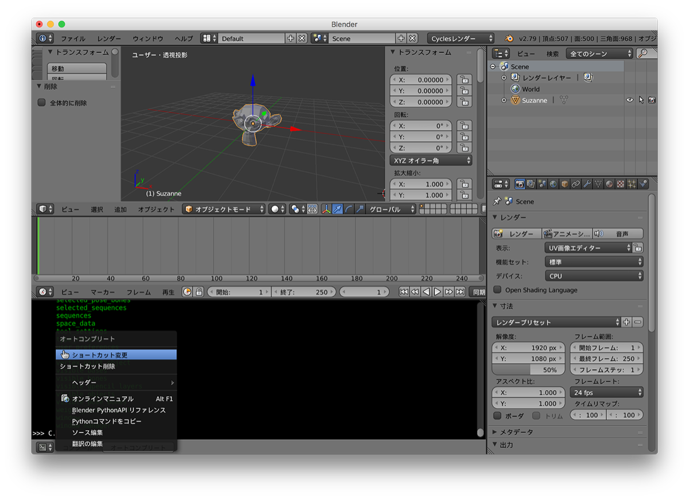
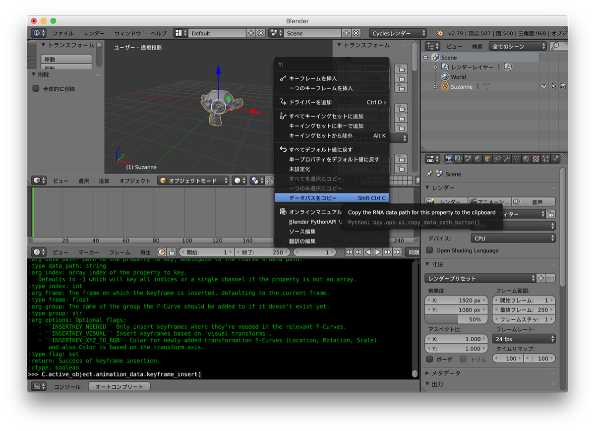

# Scripting_for_Artist  

180902  

このビデオは、よくわからないところで終わるのでよくない  

[https://www.youtube.com/watch?v=hfYgCwC_4iE](https://www.youtube.com/watch?v=hfYgCwC_4iE)  


※ デフォルトの Autocomplete のショートカットが、Control + Space で、Spotlight とバッティングする。変更はオートコンプリートのボタンの上で右クリックすると変更メニューがある。  


---  

### index  

- オブジェクトの情報を取得  
- オブジェクトの情報を変更  
- オブジェクトを追加  
- オブジェクトを追加(for ループ)  
- オブジェクトの情報を取得(for ループ)  
- アニメーション  


---  

---  

### オブジェクトの情報を取得  

```python

bpy.data.objects["Cube"].location[0]

bpy.data.objects["Cube"].location.x
bpy.data.objects["Cube"].location.y
# 3.207703113555908

bpy.data.objects["Cube"].location
# Vector((3.207703113555908, -0.6606943607330322, 2.100742816925049))

```


### オブジェクトの情報を変更  

```python
# 移動
bpy.data.objects["Cube"].location.x = -2
bpy.data.objects["Cube"].location = (1,2,3)

```


### オブジェクトを追加  

```python
bpy.ops.mesh.primitive_ico_sphere_add()

bpy.ops.mesh.primitive_ico_sphere_add(size=2)

bpy.ops.mesh.primitive_ico_sphere_add(size=2, location=(4,5,6))

```


### オブジェクトを追加(for ループ)  

```python

### for ループ
for i in range(20): bpy.ops.mesh.primitive_ico_sphere_add(size=1, location=(i,i,i))
for i in range(20): bpy.ops.mesh.primitive_ico_sphere_add(size=1, location=(i,i,-i))

```
for ループの結果  
  


### オブジェクトの情報を取得(for ループ)  

```python
for i in bpy.context.selected_objects: print(i.name)
```


### アニメーション  
```python
C.active_object.animation_data_create()
# bpy.data.objects['Suzanne']...AnimData
```

データパスをコピー  


---  

よくわからんところで終わり、萎えた。


