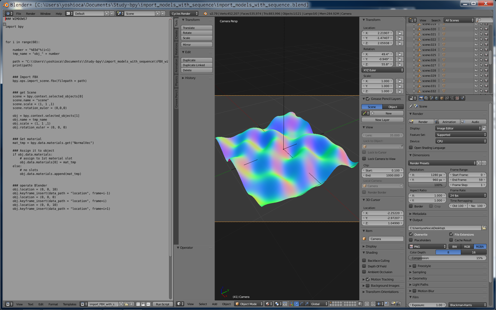

# import_models_with_sequence  


  


もにょもにょ動くレンダリングをしたい。

連番の FBX を読み込み、キーフレームにアサイン。  
レンダリングしたくないときは、どこか遠くに置いておく。  

```
i-1 フレーム : どこか  
i フレーム : カメラ画角の中  
i+1 フレーム : どこか  
```


---  


### bpy tips  

```python
### これで選択中のオブジェクト複数とれる
bpy.context.selected_objects

scene = bpy.context.selected_objects[0]
obj = bpy.context.selected_objects[1]

```

```python
### ファイル中にあるマテリアルを名前指定でとれる
mat_tmp = bpy.data.materials.get("NormalVec")

```

```python
### Assign it to object
if obj.data.materials:
    # assign to 1st material slot
    obj.data.materials[0] = mat_tmp
else:
    # no slots
    obj.data.materials.append(mat_tmp)

```

---  