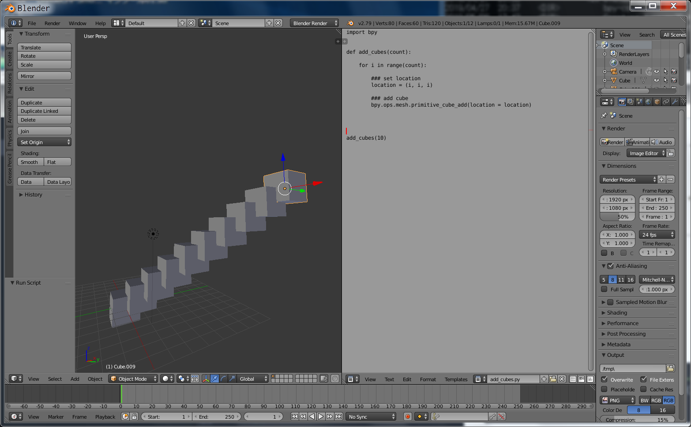
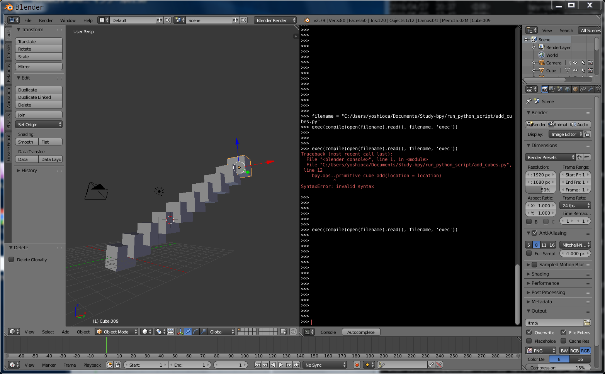

# run_python_script  


Blender には、 Python コンソールがある。

外部エディタで書いて、都度都度コンソールにコピペでも OK。  
for などのインテンドの中での改行がたぶん NG。とても不便。  

Python ファイルで実行したい。  
方法はこれら。

- [Blender] Text Editor Mode + Run  
- [Blender] On Python Console  
- [Terminal] Operate Blender via CUI  


---  

---  


### [Blender] Text Editor Mode + Run  


ファイルを開いて、ラン。  

Open [Alt + o] > select file > Run Script [Alt + p]  

  


---  


### [Blender] On Python Console  


パスを指定して、実行。  

  

Python の exec で実行。
```python
filename = "/full/path/to/script.py"
exec(compile(open(filename).read(), filename, 'exec'))

```

bpy で実行。  

```python
import bpy
script = bpy.data.texts["script_name.py"]
exec(script.as_string())
```


---  


### [Terminal] Operate Blender via CUI  

Blender の実行パスを通してあればこういうもの出来るっぽい。  

```
$ blender filename.blend --python script.py
```


---  

---  


### ref  

HOW TO RUN A PYTHON SCRIPT IN BLENDER?  
[https://learnsharewithdp.wordpress.com/2018/08/27/how-to-run-a-python-script-in-blender/](https://learnsharewithdp.wordpress.com/2018/08/27/how-to-run-a-python-script-in-blender/)  

---  